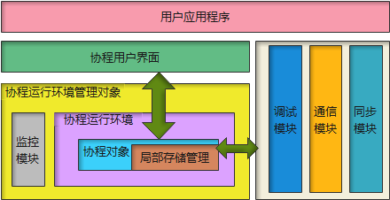
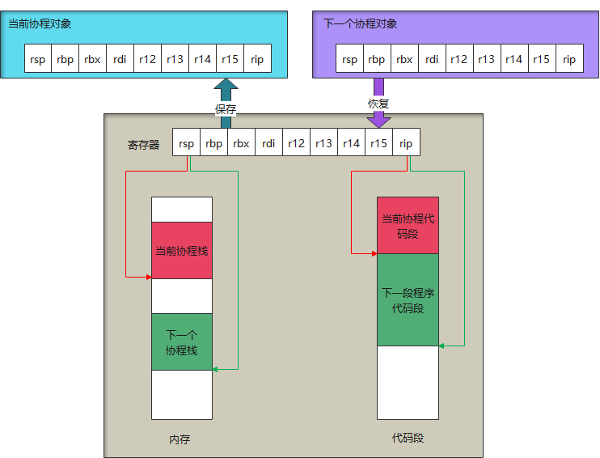
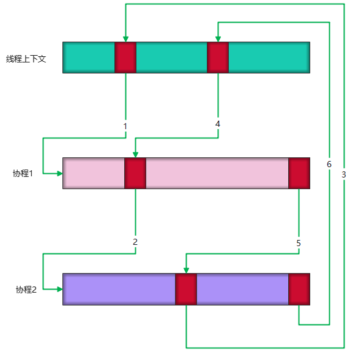
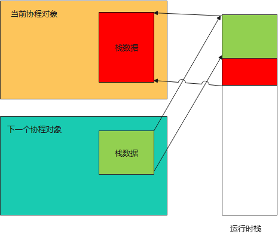
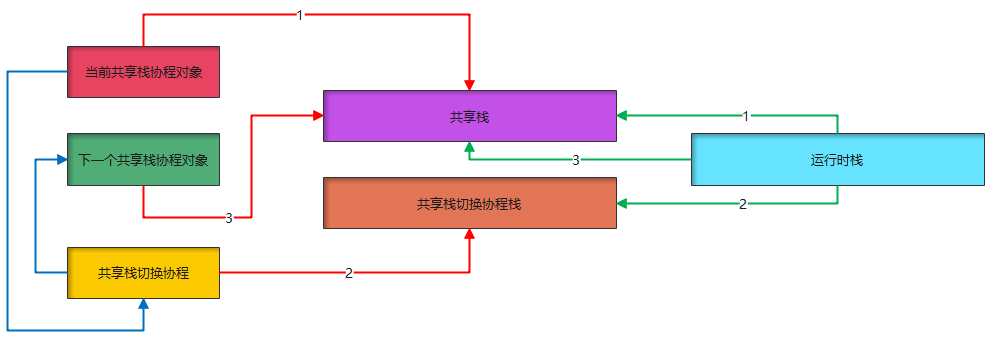

[toc]

# 文档说明

此文档编写的目的是记录协程库`cocpp`设计开发中的思路、设计与分析。目标读者为想了解一个协程库从无到有的过程的学习人员。

# 问题定义

## 背景

目前`github`上已经有很多开源的协程实现了，如：[`libco`](https://github.com/Tencent/libco)，[`libgo`](https://github.com/Tencent/libco)，[`bthread`](https://github.com/apache/incubator-brpc)（`bthread`是`brpc`底层的一个组件）等。那么为什么还要费时费力开发一个协程库呢？我理想中的协程库是什么样的呢？

首先我先回答一下第二个问题，我理想中的协程库是什么样？

- 协程与线程`M:N`对应
  就是说协程可以在不同的线程间切换，以避免有的线程撑死，有的线程饿死的局面。
- 可选共享栈
  这个需求主要是从节省内存的目的出发，多个协程共享一个栈，在协程切换出去的时候仅保留自身使用过的一小部分栈内存。被调度时将自身的栈内存恢复。
- 死循环自动切换
  当某个协程发生死循环的时候，同一个调度线程下的协程不能被阻塞。
- 可以获取协程的返回值
  可以对协程进行等待并获取其返回值。
- 友好的接口
  最好是可以与`std::thread`类似的接口调用，减少学习成本，会用线程，就会用协程。


对于以上要求来说，目前还没有发现有协程库完全具有以上所有功能的（如果有，请务必告诉我）。上述提到的协程库仅能部分满足上述条件。

所以，现在来解答第一个问题，为什么还要费时费力开发一个协程库呢？

原因有以下几点：

- 现在的协程库达不到我的预期
- 希望通过从`0`开发一个协程库来提升自己
- 通过完整开发一个项目开规范自身的开发习惯

## 总体要求

### 功能要求

#### 主要要求

- 协程与线程关系`M:N`
- 共享栈支持
- 死循环自动切换
- 返回值可获取（协程可等待）
- 具有与`std::thread`相同或者类似的接口
- 不存在内存泄露

#### 次要要求

- 协程可分离（`detach`）
- 简单的协程通信方式（`channel`）
- 协程同步（锁、信号量）
- 协程局部存储
- 协程`ID`
- 协程状态查询

### 性能要求

- 与主流协程库的差距在一个数量级内（主要为`libco`和`libgo`，由于`bthread`与`brpc`绑定，此处暂不考虑）

### 资源要求

- 非共享模式下，除栈空间（可配置）外，每个协程额外占用的内存数量不超过`1KB`。
- 共享模式下，每个协程占用的内存数量不超过`1KB`

### 维测需求

- 协程中出现异常时，需要可以查看问题发生时的调用栈信息、栈内存数据、协程上下文数据。
- 专门的调试工具或者`gdb/lldb`的插件支持

### 开发规范要求

- 单元测试分支覆盖率`80%`以上
- 各阶段文档全面（本文档），主要包括概要设计、详细设计、测试数据（功能、性能）、构建部署说明等
- 代码开发命名良好、模块边界清晰、依赖性小。代码圈复杂度低，重复度低。
- 持续集成

### 环境要求

- 编译器需要支持`c++20`（暂定为`clang++ 10.0.0-4`）
- 操作系统为`linux`
- `CPU`架构为`AMD64`（第一版暂仅支持`AMD64`）

# 概要设计

## 模块划分

`cocpp`应该至少包含以下几个部分:

- 协程用户界面
  这里并不是指的`GUI`用户界面这个意思，而是指用户通过一个对象来访问协程对象。此对象提供协程的创建、等待、状态查询、销毁等接口。
- 协程对象
  实际的协程对象，比用户界面更多的功能与控制接口，用户界面是协程对象中暴露给用户的一部分`API`，而协程对象提供的是暴露给协程的管理对象的接口。
- 协程运行环境
  协程被执行的上下文环境，关联一个执行线程。此外，还包括了共享栈协程栈内存的管理。
- 协程运行环境管理对象
  全局唯一，主要负责协程运行环境的创建、回收，自动伸缩等。
- 调试模块
  负责与外部调试工具对接。
- 协程同步模块
  主要提供协程间的同步、互斥、等待等。
- 通信模块
  各协程间传递数据使用。
- 局部存储管理
  协程私有数据管理。
- 监控模块
  用于监控协程的执行状态，找到死循环线程等。

## 总体结构

以上的模块结构组织如下：



对于上层用户来说，可见的有协程用户界面，主要提供协程的创建以及用户级管理。调试模块、通信模块和同步模块。

协程运行环境管理模块负责创建、管理、监控协程的运行环境，协程运行环境为协程对象提供执行环境。协程对象中包含协程局部存储的管理。

协程运行环境管理对象中包含一个监控模块对每个协程运行环境进行监控，其监控结果将指导环境管理对象对执行环境进行伸缩、销毁等。

协程对象开放一部分`API`给协程用户界面使用，提供管理、控制等功能。同时为调试、通信和同步模块提供需要的服务。

# 详细设计

## 协程切换

为什么没有先设计协程的创建，而是先设计协程的切换呢？因为协程的创建到开始运行，其实也是一种切换，只是第一次切换没有“当前协程”这个概念。

**协程的切换其本质是协程上下文的切换，那么协程的上下文主要包含哪些内容呢？**

### 协程上下文包含的内容

- 协程栈
- 协程寄存器  

每个协程都有一个独立的栈空间和一些私有寄存器（这里的私有寄存器是指需要被调用者保存的寄存器，包括`rdi,rbp,rbx,rsp,rip,r12,r13,r14,r15`，其实`rdi`不需要保存，但是协程创建的时候我们需要使用它传递第一个参数，所以将他也保存下来），要切换协程其实就是将当前协程的栈空间和寄存器保存下来，然后恢复要切换到的协程的栈空间和寄存器。由于`rsp`寄存器指示了当前栈空间的栈顶位置，所以只需要保存`rdi,rbp,rbx,rsp,rip,r12,r13,r14,r15`这`9`个寄存器就好了。

**知道了保存哪些内容，那么一次协程切换的步骤是什么呢？**


### 普通协程切换

这里我们先讨论一下普通（非共享栈）的切换。

#### 一次协程切换的步骤

我们可以使用一个大小为`9`的`void*`数组来保存这些寄存器的值。

协程切换的步骤就是将当前寄存器的值保存，将目标寄存器的值恢复，然后跳转到目标寄存器的`rip`。

流程如下：



图中表示要从“当前协程”切换到“下一个协程”，当前协程在运行的时候，运行环境的寄存器`rsp`保存着当前协程的栈顶位置，`rip`保存着当前协程的代码段地址。

发生切换时，第一步是保存当前执行环境，就是将当前执行环境中的相关寄存器保存到当前协程对象的存储中。
第二步是将下一个协程对象中存储的寄存器信息恢复到运行环境相应的寄存器中。

当完成这两个步骤之后，协程就完成了切换。

**目前已完成单次协程切换流程的讨论，那么，如果完成在多个协程之间切换并执行完成返回呢？**

#### 在多个协程间切换并最终返回

我们将这个步骤封装为一个函数（假设为`switch_co`，`switch_co`的具体实现在后文描述），在当前协程中调用，传入要切换的协程的协程对象，然后当新协程执行一段时间后，再调用此函数，传入其他协程的协程对象，这样就可以在不同的协程间切换了。搭配一定的选择策略，一个调度器的逻辑就完成了。

下面展示一个完整的协程切换的图示：



图中红色部分就是上面提到的切换函数`switch_co`。

1. 整个流程从一个线程开始（一开始还没有创建协程，起始的线程可以称为主协程），运行一段时间后，调用`switch_co`创建一个协程。没错，`switch_co`可以用来创建协程，我们只需要构造一个协程1的协程对象，将协程1的入口地址（假设为`co_entry1`）设置为`rip`，将协程1的栈底设置为`rsp`（或者说栈顶，一开始栈是空的，栈顶与栈底相等），再调用`switch_co`就相当于创建了一个以`co_entry1`为入口的协程。
2. 协程1运行一段时间后，又以相同的办法创建了协程2。
3. 协程2运行一段时间后，调用`switch_co`切换到主协程。
4. 主协程调用`switch_co`切换到协程1
5. 协程1运行结束，调用`switch_co`切换到协程2
6. 协程2运行结束，调用`switch_co`切换到主协程
7. 主协程运行结束，返回到上一层调用栈

**注意到上面协程1和协程2结束的时候，需要再调用一次`switch_co`，这是为什么呢？**

#### 协程入口函数返回方法

因为协程的栈空间是用户分配的，切换到协程的栈空间是由`switch_co`完成的，因此，协程入口函数并没有上一级调用者，当入口函数值性结束后，栈的状态和初始的状态应该保持一致（空），如果此时进行函数返回，`CPU`会从`rsp`的位置弹出一个值作为`rip`，但是此时`rsp`指向内存的值是无效的（不是不能访问，而是说并不是指向上一级调用函数，因为不存在上级调用函数），所以会发生段错误。因此需要在协程入口函数结束的时候跳转到其他协程（且不再跳回来），最终跳转到主协程，由主协程返回上一级调用函数（主协程使用的是线程上下文，有上一级调用函数）。

协程入口函数需要最终调用`switch_co`切换到其他协程，这个步骤怎么保证呢？

#### 对协程入口函数进行封装

以上讨论了协程入口返回函数需要调用`switch_co`进行切换，那么谁来保证调用呢，目前有两个选择：

- 协程创建者
  由创建者在函数返回的时候调用。
- 协程框架调用
  定义通用协程入口函数，包装用户传入的入口函数

以上两种方案中，应该选择第二种。理由如下：

1. 无法保证用户一定会在协程返回之前调用`switch_co`，写在文档中？相信我，大多数开发人员只在出错的啥时候看一眼文档。
2. 协程入口函数出现异常的时候，无法调用`switch_co`。导致程序崩溃。
3. 协程入口函数不能带有返回值。如果要在函数返回之前调用`switch_co`，那么函数就不能有返回值，即使有返回值也执行不到，而事实上，很多协程的创建就是为了计算出一个结果，供其他协程使用。没有返回值的协程，就失去了它的价值。

而使用第二种方案就可以完全解决以上问题。包装函数伪代码如下：

```cpp
void wrap_co_entry(user_co_entry, args ...) {
    try {
        result = user_co_entry(args ...);
    } catch (...) {
        // 处理异常
    }
    switch_co(this_coroutine_object, other_coroutine_object);
}
```

针对上面第一个问题，通过函数调用包装，保证在调用了用户的协程函数入口返回后调用`switch_co`，防`rsp`无效导致`rip`跳转到无效地址。

对于第二个问题，在包装函数中进行异常捕获，从而保证无论是否有没有异常，都能调用到`switch_co`。

第三个问题，可以通过调用用户入口函数并且获取返回值，并传递到外层。

综上，可以选择第二种方案，使用包装函数包装协程入口。

上面讨论了一般协程的切换，接下来讨论一下共享栈。

### 共享栈切换

在讨论共享栈切换之前，先了解一下什么是共享栈协程，以及共享栈协程相对非共享栈有什么优点。

#### 共享栈协程的特点

共享栈，顾名思义，就是多个协程共享一个栈。栈是一个协程的私有数据，怎样做到共享呢？



运行时栈当前内容是当前协程对象的栈数据，当要从当前协程切换到下一个协程的时候，首先将运行时栈属于当前栈数据的有效内容保存到当前协程对象中，有效内容可以根据运行时栈的栈底和栈顶指针计算出来（栈顶指针就是`rsp`，因为协程栈是我们自己分配的，所以我们是知道栈底指针的位置的）。然后将要切换的协程对象中的栈数据复制到运行时栈，**再按照普通协程那个切换寄存器的值，就完成了共享栈的协程切换**。

总结一下，共享栈的特点就是每个协程只需要保存当前协程有效的栈内存，另外有一个共享的运行时栈。协程运行的时候，将自身的有效栈空间恢复到运行时栈，切换出去的时候，将运行时栈的有效内存重新保存到协程对象中。

#### 共享栈协程的优劣及应用场景

从上面的讨论介可以得出，非共享栈协程每个协程都有独立的栈空间，切换的时候只需要保存恢复寄存器的值。而共享栈协程共享一个运行时栈，当协程没有运行的时候，协程对象保存着当前的有效栈数据。当协程运行的时候，将有效栈数据复制到运行时栈。

对比非共享栈协程和共享栈协程：

|          | 非共享栈协程                     | 共享栈协程                               |
| :------- | :------------------------------- | :--------------------------------------- |
| 切换速度 | 快，仅保存恢复寄存器             | 慢，除了寄存器外，还要保存恢复协程有效栈 |
| 内存使用 | 多，每个协程都有自己的独立栈空间 | 少，每个协程仅保存有效的栈数据           |

所以，非共享栈适用于对性能要求较高，数量不大的协程。而共享栈可以用于需要创建大量协程，但对切换效率不敏感的场景。

综上，共享栈的本质就是时间换空间。

#### 共享栈协程切换的方法

从上面的讨论得知，共享栈协程切换的时候，比非共享栈协程多了有效栈内容的保存和恢复，那么，谁来做这个操作呢？

一种方案是由当前协程去做，在`switch_co`中增加保存当前协程有效内存，恢复下一个协程的有效内存。但是这样有个问题。当前协程正在运行，当我们保存了当前栈有效空间的时候，再去保存寄存器，此时可能涉及调用一些函数，当前栈的有效内存就发生了变化，之前保存的内存就失效了。

解决方案就是停止当前协程，在另一个协程里保存。这个时候你想到的第一个协程可能是目标协程，但是在目标协程中是不可能实现这个功能的，因为需要先切换才能运行目标协程，而栈内存的保存恢复发生在切换之前。

所以，我们需要第三个协程来辅助保存、恢复协程的共享栈。伪代码如下：

```cpp
void switch_stack_and_registers(current_context, new_context) {
    switch_co(current_context, switch_stack_context);
}

void switch_stack_entry() {
    save_stack(current_context);
    restore_stack(new_context);
    switch_co(switch_stack_context, new_context);
}
```

当前协程调用 `switch_stack_and_registers` 切换到专门用于保存恢复共享栈的协程上下文，该协程保存上一个协程的共享栈，因为上一个协程已经不在运行了，所以此时切换没有风险。然后恢复下一个要运行的协程的共享栈，因为下一个协程还没有开始运行，所以也是安全的。最后再切换到目标协程。图示如下：



图中蓝色的连接线表示协程的切换流程，红色的线表示协程对应的协程栈，绿色的线表示运行时栈的变化顺序。

1. 初始状态时，运行时栈中的内容是当前共享栈协程栈。对应关系为线1所示
2. 当前共享协程需要发生切换时，临时切换到共享栈切换协程。这时候运行时栈切换到共享栈切换协程栈。如线2所示。
3. 此时当前协程已经被停止运行了，共享栈的内容不再发生改变，所以共享栈切换协程可以放心地保存当前共享栈的内容保存到当前协程的协程对象中。再把下一个共享协程的栈内存恢复到共享栈中。然后调用`switch_co`切换到下一个共享栈协程。此时的关系如线3所示。

### 在非共享栈协程与共享栈协程之间切换

上面讨论了非共享栈协程与非共享栈协程、共享栈协程与共享栈协程之间的切换。最后我们讨论一下在共享栈协程与非共享栈协程之间的切换。

- 从非共享栈协程切换到共享栈协程
  非共享栈协程，不需要保存协程栈，所以，仅需要恢复下一个协程的共享栈，完成后切换寄存器就好了。
- 从共享栈协程切换到非共享栈协程
  共享栈协程，需要保存一下共享栈，非共享栈协程不需要恢复栈。所以保存后直接切换寄存器就可以了。

伪代码如下：

```cpp
void switch_between_shared_and_not_shared(current_context, new_context) {
    if(is_shared_stack(current_context)) {
        save_stack(current_context);
    }
    if(is_shared_stack(new_context)) {
        restore_stack(new_context);
    }
    switch_co(switch_stack_context, new_context);
}
```

### 什么时候需要共享栈切换协程

从上面的讨论我么们知道，共享栈切换协程是为了防止共享栈协程直接操作自身的栈内存而出现问题，但是协程切换是有开销的，我们能不能尽量减少切换呢？什么时候可以不必要切换到共享栈切换协程呢？

接下来对四种切换情况做一下分析。

- 非共享栈协程切换到非共享栈协程
  不涉及操作共享栈内存
- 非共享栈协程切换到共享栈协程
  涉及到共享栈的恢复，可以在当前协程完成，因为当前协程的栈不是共享栈，所以操作共享栈是安全的。
- 共享栈协程切换到非共享栈协程
  保存当前共享栈的时候需要操作共享栈，需要引入共享栈切换协程
- 共享栈协程切换到共享栈协程
  保存当前共享栈的时候需要操作共享栈，需要引入共享栈切换协程

综上，是否需要引入共享栈切换协程的判断依据就是当前协程是否是共享栈，如果当前协程是共享栈协程，那么就需要引入共享栈切换协程。

### 本节总结

本节先讨论了非共享栈协程的切换，说明了引入入口包装函数的必要性。接下来分析了共享栈的优缺点。通过引入共享栈切换协程辅助共享栈完成切换。最后讨论了在什么时候共享栈切换协程是必需的，什么时候可以省略。

## 协程创建

上一节讨论了协程的切换，覆盖了非共享栈协程与共享栈协程的切换。本节讨论一下如何进行协程的创建。

### 协程运行环境

在创建一个协程前，我们首先得需要一个协程运行环境`co_env`，一个`co_env`与一个操作系统线程绑定，为协程提供基础的可运行条件。

那么，首先我们先看一下，协程运行环境应该包含哪些内容。

- 主协程对象
  当前线程对应的协程对象，为了在创建第一个协程的时候，保存当前的寄存器信息
- 协程的执行线程
  协程运行的执行实体。
- 当前正在运行的协程对象
  记录当前运行的协程
- 上一个共享协程对象
  记录上一个协程的共享协程对象，主要是给共享栈切换协程使用，保存上一个协程对象的有效栈空间
- 下一个共享协程对象
  记录将要切换的共享协程对象，也是给共享栈切换协程使用，恢复下一个协程对象的有效栈空间
- 等待运行的协程队列
  被切换出去的协程队列
- 共享栈空间
  共享栈的实际内存空间，应该与协程运行环境绑定，这样可以避免共享栈的竞争问题。

后续可能会由于功能增加而增加一些额外的字段，诸如退出标记、环境状态、监控信息等，这里暂不讨论。

关于协程环境的创建流程，我们将协程对象的内容讨论完毕后一并讨论。

### 协程对象

创建一个协程，其实就是创建一个协程对象（记作`co_obj`），那么一个协程对象需要保留哪些内容呢？

- 共享栈标识
- 共享栈有效栈内存
- 栈内存指针
- 栈大小
- 协程入口函数
- 寄存器值（上下文）
- 协程状态（就绪、运行、结束）


以上是目前可以用到的，后续可能随着功能的增加而增加更多内容，如协程局部存储等，这里暂不讨论。

### 创建协程运行环境

要运行一个协程，第一步必须先要给他创建一个执行环境。那么我们看一下执行环境的创建步骤。

我们从执行环境的字段从上到下依次说明。

#### 创建主协程对象
  创建主协程对象的目的是为了保存当前线程的上下文信息，让其他协程依然可以切换回来。创建一个主协程对象的流程如下：
  1. 设置共享栈标识为非共享
  2. 设置协程状态为正在运行（`running`）
  其他值不需要设置。理由如下：
  - 寄存器值在第一次切换出去的时候会被覆盖，现在设置无意义。
  - 主协程独享是非共享栈协程，所以不存在有效栈内存。
  - 主协程的栈内存不需要手动非配，所以没有栈内存指针。
  - 栈大小，同上。
  - 协程入口地址，主协程的入口地址为线程入口地址，且后续不会再使用，不需要设置。
#### 创建协程的执行线程
  此时就是创建一个线程，用来执行协程，那么这个线程里面需要做哪些操作呢？作为协程的运行环境，主要的任务就是从等待运行的的协程队列中挑选一个协程去运行。伪代码描述如下：
  ```cpp
  void co_env_thread_entry(){
      while(!should_exit()) {
          next_co_obj = choose_one_obj_from_ready_queue();
          if (next_co_obj == main_co_obj) {
              continue;
          }
          switch_co(main_co_obj, next_co_obj);
      }
  }
  ```
  执行线程对应的协程为主协程`main_co_obj`，所以每次选择一个协程，都从主协程切换出去。
  
#### 设置当前正在运行的协程对象
  当前正在运行的协程对象就是主协程，将上面创建的主协程对象赋予正在运行的协程对象就好了。

#### 设置上一个共享协程对象
  当期不存在上一个共享协程对象，留空。

#### 设置下一个共享协程对象
  当前不存在下一个共享协程对象，留空。

#### 创建等待运行的协程队列
  当前等待运行的协程队列为空，只需要创建出来就可以了。
#### 分配共享栈空间
  共享栈空间应该与协程执行环境绑定，所以在执行环境创建的时候需要将共享栈空间分配出来。这个共享栈空间可以设置为一个足够大的固定值（多个协程共享，所以即使分配的大一点也不会对内存造成很大压力）。

### 创建非共享栈协程

当协程的执行环境创建完成之后，协程就具备了可运行的条件。我们这里先讨论一下非共享栈协程的创建。

#### 设置共享栈标识
  将共享栈标识设置为非共享。
#### 设置共享栈有效栈内存
  留空即可，不使用。
#### 设置栈内存指针
  这里需要分配一块内存作为当前协程的栈空间。
#### 设置栈大小
  设置上面分配栈空间的大小。
#### 设置协程入口函数
  设置协程入口函数，此函数供包装函数`wrap_co_entry`调用。
#### 寄存器值（上下文）
  设置初始的寄存器值，这里需要设置的有4个寄存器的值：
  - rip
  恢复协程（或者首次运行协程）的时候，`rip`会作为返回地址指导跳转到何处。所以这里需要设置协程入口函数的地址。从上文讨论可知，我们需要将协程入口做一下封装，所以这里传入的是封装后函数`wrap_co_entry`的地址。
  - rdi
  设置`rdi`的目的是为了给`wrap_co_entry`传递参数（`x86_64`下第一个参数通过`rdi`寄存器传递），这里将`rdi`设置为当前协程对象的指针即可。
  - rbp
  设置栈的基址，注意，这里的栈基址并不是栈内存指针，因为栈的增长方向是从高地址向低地址的，所以`rbp`应该设置为栈内存指针`+`栈大小的位置。
  - rsp
  初始状态栈内容为空，所以设置为与`rbp`相同的值。

#### 设置协程状态（就绪、运行、结束）
  将协程状态设置为就绪。

#### 将创建好的协程对象装入协程执行环境的就绪队列

  完成协程对象的创建之后，就可以将协程对象装入协程执行环境的就绪队列了，因为协程运行环境的主协程会不断从就绪队列中获取协程并执行，所以，我们创建的协程对象用不了多久就可以被执行了。

讨论了非共享栈协程的创建，再来看一下共享栈协程的创建。

### 创建共享栈协程

创建一个共享栈协程，与非共享栈协程的总体步骤类似，只是在栈的分配上有不同，其步骤如下：


#### 设置共享栈标识
  将共享栈标识设置为共享。
#### 设置共享栈有效栈内存
  初始状态没有有效栈内存，留空即可。
#### 设置栈内存指针
  不使用，设置为空。
#### 设置栈大小
  不使用。  
#### 设置协程入口函数
  与非共享栈协程一致。
  
#### 寄存器值（上下文）
  设置初始的寄存器值，与非共享栈协程一样，这里也需要设置的有4个寄存器的值：
  - rip
  与非共享栈协程一致。
  - rdi
  与非共享栈协程一致。
  - rbp
  设置栈的基址，设置为运行环境中申请的共享栈地址`+`共享栈大小。
  - rsp
  与非共享栈协程一致，设置为与`rbp`相同的值。

#### 设置协程状态（就绪、运行、结束）
  与非非共享栈协程一致,，设置为就绪状态。
#### 将创建好的协程对象装入协程执行环境的就绪队列
  与非共享栈协程一致。

### 协程开始调度执行（switch_co的执行逻辑）

协程开始调度执行，就是使用`switch_co`从主协程切换到刚创建的协程时候，那么，`switch_co`的逻辑是什么呢？

#### 保存当前执行环境


## 协程同步

## 协程等待

## 协程状态

## 协程转移

## 协程分离

## 协程销毁

## 协程通信

## 协程局部存储

## 协程ID

## 用户接口

# 测试数据

# 构建部署说明

# 未来规划